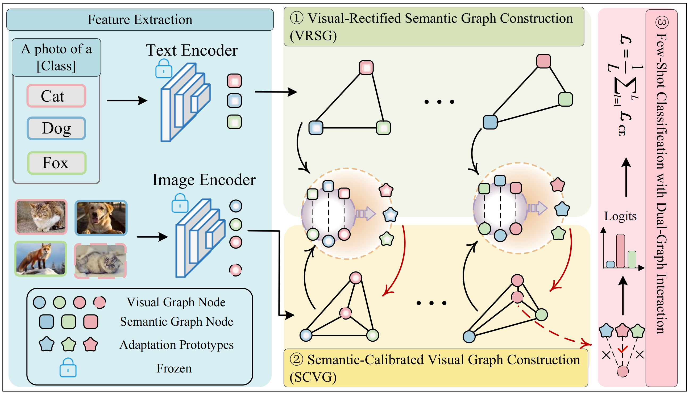

# DGCM: Dual Graph Neural Network with Cross-Modal Alignment

## 📖 Introduction

Few-Shot Learning (FSL) has emerged as a promising paradigm to address the issue of data scarcity in deep learning. 
Graph Neural Networks demonstrate massive potential in FSL by modeling the topological relationships among scarce 
samples. However, existing methods are mostly confined to a single visual modality, overlooking the inherent structural
misalignment between visual distributions and semantic embeddings. To address this issue, we propose a Dual Graph Neural
Network with Cross-Modal Alignment (DGCM) aiming to effectively bridge the modal gap between visual distributions and 
semantic embeddings. Specifically, we first construct a dual-graph framework comprising a Visual-Rectified Semantic
Graph and a Semantic-Calibrated Visual Graph, which serves as the topological foundation for cross-modal feature 
interaction and deep alignment. Second, we design Visual-Rectified (VR) and Semantic-Calibrated (SC) cross-modal
interaction mechanisms for the dual graphs. These mechanisms enable semantic priors to dynamically adapt to visual 
features to generate task-specific adapted prototypes, which then guide the visual features to accomplish semantic 
alignment. The SC and VR mechanisms cooperate closely to build a cross-modal bidirectional alignment system, thereby 
genuinely bridging the modal gap between vision and semantics. Extensive experiments on four benchmark datasets 
demonstrate the superiority of DGCM. Under 1-shot and 5-shot settings, the performance of the model surpasses advanced 
methods by 1.58\% and 1.93\%, respectively.

  

## 📂 Dataset Preparation

Please download the benchmark datasets and organize them into the `dataset/` directory. The expected file structure is as follows:

dataset/
├── cifar_fs/
│   ├── data/
│   └── splits/
├── CUB_200_2011/
│   ├── attributes/
│   ├── images/
│   ├── parts/
│   ├── split/
│   └── ... (txt files: classes.txt, images.txt, etc.)
├── mini-imagenet/
│   ├── images/
│   ├── split/
│   ├── train.csv, val.csv, test.csv
│   └── imagenet_class_index.json
└── tiered_imagenet/
    ├── train/
    ├── val/
    ├── test/
    └── class_names.json

🚀 Installation & Usage
1. Requirements
Install the necessary dependencies using the provided requirements file:

Bash
pip install -r requirements.txt
python -m nltk.downloader wordnet

2. Training and Evaluation
We provide straightforward commands to train and evaluate DGCM via main.py.

Training:
Bash
python main.py --config cub200_config_5way_1shot --mode train
python main.py --config cub200_config_5way_5shot --mode train

Evaluation:
Bash
python main.py --config cub200_config_5way_1shot --mode eval
python main.py --config cub200_config_5way_5shot --mode eval

🏆 Benchmarks
Our model achieves the following performance on mini-ImageNet, tiered-ImageNet, CUB and CIFAR-FS (more detailed experimental results are in the paper).

miniImageNet:
| Method          | Backbone     | 5-way 1-shot   | 5-way 5-shot   |
| --------------- | ------------ | -------------- | -------------- |
| HGNN            | Conv4        | 60.03±0.51     | 79.64±0.36     |
| CSTS            | Conv4        | 62.38±0.48     | 79.77±0.44     |
| FSAKE           | Conv4        | 61.86±0.72     | 79.66±0.62     |
| FCGNN           | Conv4        | 64.59±0.53     | 81.88±0.45     |
| MGGN            | ResNet12     | 65.73±0.52     | 83.29±0.37     |
| HybridGNN       | ResNet12     | 67.02±0.20     | 83.00±0.13     |
| DPGN            | ResNet12     | 67.77±0.32     | 84.60±0.43     |
| MTSGM           | ResNet12     | 69.56±0.20     | 85.19±0.13     |
| MTSGM           | ResNet101    | 70.42±0.20     | 86.27±0.14     |
| SP-CLIP         | Visformer-T  | 72.31±0.40     | 83.42±0.30     |
| SemFew-Trans    | Swin-T       | 78.94±0.66     | 86.49±0.50     |
| VSFSM-Guass     | Swin-T       | 82.79±0.70     | 87.84±0.50     |
| CLIP-LP+LN      | ViT-B/16     | 92.08          | 97.94          |
| FD-Align        | ViT-B/32     | 95.04±0.18     | 98.52±0.07     |
| P>M>F (ext.)    | ViT-B/16     | 95.30          | 98.40          |
| SgVA-CLIP       | ViT-B/16     | 97.95±0.19     | 98.72±0.13     |
| **DGCM (Ours)** | **ViT-B/16** | **98.54±0.14** | **99.24±0.07** |

tieredImageNet:
| Method          | Backbone     | 5-way 1-shot   | 5-way 5-shot   |
| --------------- | ------------ | -------------- | -------------- |
| HGNN            | Conv4        | 64.32±0.49     | 93.34±0.45     |
| CSTS            | Conv4        | 64.84±0.26     | 82.95±0.44     |
| FSAKE           | Conv4        | 65.27±0.73     | 83.33±0.62     |
| FCGNN           | Conv4        | 66.76±0.54     | 84.99±0.42     |
| MGGN            | ResNet12     | 70.12±0.75     | 86.53±0.95     |
| HybridGNN       | ResNet12     | 72.05±0.23     | 86.49±0.15     |
| DPGN            | ResNet12     | 72.45±0.51     | 87.24±0.39     |
| MTSGM           | ResNet12     | 73.63±0.22     | 87.66±0.15     |
| MTSGM           | ResNet101    | 74.56±0.23     | 88.36±0.16     |
| SP-CLIP         | Visformer-T  | 78.03±0.46     | 88.55±0.32     |
| SemFew-Trans    | Swin-T       | 82.37±0.77     | 89.89±0.52     |
| VSFSM-Guass     | Swin-T       | 86.49±0.83     | 91.34±0.53     |
| SgVA-CLIP       | ViT-B/16     | 95.73±0.37     | 96.21±0.37     |
| **DGCM (Ours)** | **ViT-B/16** | **97.31±0.24** | **98.14±0.19** |

CUB:
| Method          | Backbone     | 5-way 1-shot   | 5-way 5-shot   |
| --------------- | ------------ | -------------- | -------------- |
| VSFSM-Guass     | Swin-T       | 54.61          | 62.98          |
| CSTS            | Conv4        | 60.83±0.45     | 77.12±0.44     |
| HGNN            | Conv4        | 69.43±0.49     | 87.67±0.45     |
| DPGN            | ResNet12     | 75.71±0.47     | 91.48±0.33     |
| FSAKE           | Conv4        | 77.00±0.70     | 89.66±0.50     |
| HybridGNN       | ResNet12     | 78.58±0.20     | 90.02±0.12     |
| MTSGM           | ResNet12     | 81.23±0.20     | 91.94±0.12     |
| FCGNN           | Conv4        | 82.00±0.48     | 92.55±0.32     |
| MTSGM           | ResNet101    | 82.18±0.22     | 92.70±0.12     |
| FD-Align        | ViT-B/32     | 82.38±0.69     | 93.87±0.24     |
| CLIP-LP+LN      | ViT-B/16     | 93.73          | 98.50          |
| **DGCM (Ours)** | **ViT-B/16** | **95.90±0.34** | **98.06±0.18** |

CIFAR-FS:
| Method          | Backbone     | 5-way 1-shot   | 5-way 5-shot   |
| --------------- | ------------ | -------------- | -------------- |
| CSTS            | Conv4        | 62.47±0.47     | 81.82±0.42     |
| FSAKE           | Conv4        | 69.78±0.69     | 85.92±0.55     |
| FCGNN           | Conv4        | 72.36±0.53     | 86.22±0.42     |
| MTSGM           | ResNet12     | 76.41±0.21     | 87.51±0.15     |
| MTSGM           | ResNet101    | 77.34±0.22     | 88.24±0.15     |
| DPGN            | ResNet12     | 77.90±0.50     | 90.20±0.40     |
| SP-CLIP         | Visformer-T  | 82.18±0.40     | 88.24±0.32     |
| P>M>F (ext.)    | ViT-B/16     | 84.30          | 92.20          |
| SemFew-Trans    | Swin-T       | 84.34±0.67     | 89.11±0.54     |
| VSFSM-Guass     | Swin-T       | 88.13±0.68     | 90.38±0.57     |
| **DGCM (Ours)** | **ViT-B/16** | **96.46±0.19** | **96.89±0.18** |
