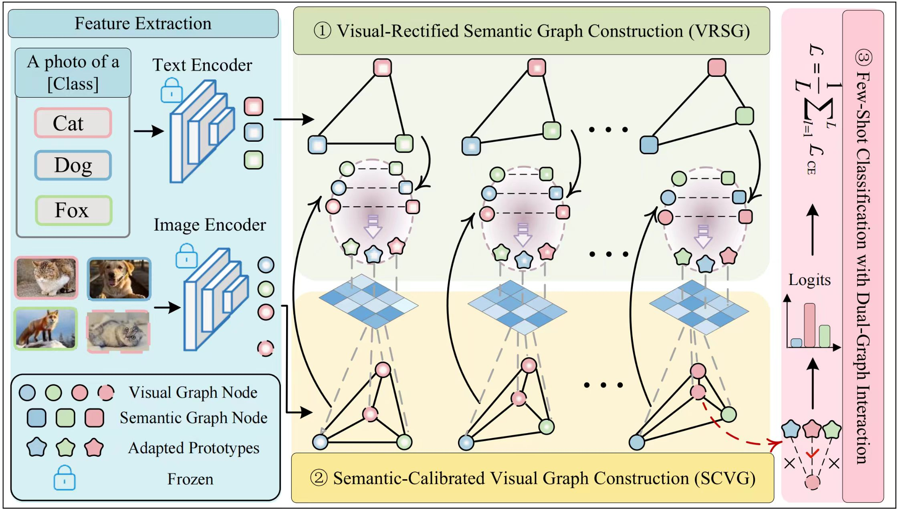

# DGCM: Dual Graph Neural Network with Cross-Modal Alignment

## 📖 Introduction

Few-shot learning (FSL) has emerged as a promising paradigm for addressing data scarcity in deep learning. Graph neural networks (GNNs) have demonstrated significant potential in FSL by capturing topological relationships among scarce samples to facilitate effective feature propagation and information aggregation. However, existing GNN-based models are mostly limited to a single visual modality, overlooking the inherent modal gap between visual distributions and semantic embeddings. To address this issue, a dual graph neural network with cross-modal alignment (DGCM) is proposed to effectively bridge this modal gap. First, dual GNNs comprising a visual-rectified semantic graph (VRSG) and a semantic-calibrated visual graph (SCVG) are constructed. The VRSG is used to model high-level class semantic distributions, while the SCVG captures underlying visual instance features and provides the topological foundation for cross-modal feature interaction and deep alignment. Second, visual-rectified and semantic-calibrated cross-modal interaction mechanisms are designed for the dual graphs. These mechanisms enable semantic priors to dynamically adapt to visual features and generate task-specific prototypes for each few-shot task. The resulting prototypes then guide the visual features toward semantic alignment. Extensive experiments on four benchmark datasets demonstrate the superiority of DGCM. The proposed model outperforms existing state-of-the-art methods by 1.58% and 1.93% in the one- and five-shot settings, respectively

  

## 📂 Dataset Preparation

Please download the benchmark datasets and organize them into the `dataset/` directory. The expected file structure is as follows:

dataset/
├── cifar_fs/
│   ├── data/
│   └── splits/
├── CUB_200_2011/
│   ├── attributes/
│   ├── images/
│   ├── parts/
│   ├── split/
│   └── ... (txt files: classes.txt, images.txt, etc.)
├── mini-imagenet/
│   ├── images/
│   ├── split/
│   ├── train.csv, val.csv, test.csv
│   └── imagenet_class_index.json
└── tiered_imagenet/
    ├── train/
    ├── val/
    ├── test/
    └── class_names.json

🚀 Installation & Usage
1. Requirements
Install the necessary dependencies using the provided requirements file:

Bash
pip install -r requirements.txt
python -m nltk.downloader wordnet

2. Training and Evaluation
We provide straightforward commands to train and evaluate DGCM via main.py.

Training:
Bash
python main.py --config cub200_config_5way_1shot --mode train
python main.py --config cub200_config_5way_5shot --mode train

Evaluation:
Bash
python main.py --config cub200_config_5way_1shot --mode eval
python main.py --config cub200_config_5way_5shot --mode eval

## 🏆 Benchmarks

We compare DGCM with relevant methods on miniImageNet, tieredImageNet, CUB, and CIFAR-FS. All results report 5-way classification accuracy (%) with 95% confidence intervals. More detailed experimental results are available in the paper.

`T` denotes a transductive method, `G` a graph-based method, `C` a CLIP-based method, and `C*` a CLIP-assisted method.

### miniImageNet

| Method | Type | Backbone | 1-shot | 5-shot |
| --- | :---: | --- | ---: | ---: |
| TIM-GD | T | ResNet18 | 73.90±0.00 | 85.00±0.00 |
| LaplacianShot | T | ResNet18 | 72.11±0.19 | 82.31±0.14 |
| PT-MAP | T | WRN | 82.92±0.26 | 88.82±0.13 |
| FCGNN | G | Conv4 | 64.59±0.53 | 81.88±0.45 |
| CSTS | G | Conv4 | 62.38±0.48 | 79.77±0.44 |
| FSAKE | G | Conv4 | 61.86±0.72 | 79.66±0.62 |
| HGNN | G | Conv4 | 60.03±0.51 | 79.64±0.36 |
| MTSGM | G | ResNet12 | 69.56±0.20 | 85.19±0.13 |
| DPGN | G | ResNet12 | 67.77±0.32 | 84.60±0.43 |
| HybridGNN | G | ResNet12 | 67.02±0.20 | 83.00±0.13 |
| MGGN | G | ResNet12 | 65.73±0.52 | 83.29±0.37 |
| MTSGM | G | ResNet101 | 70.42±0.20 | 86.27±0.14 |
| CrossHypergraph | G | ViT-S/16 | 73.57±0.61 | 88.44±0.36 |
| VSFSM-Guass | C* | Swin-T | 82.79±0.70 | 87.84±0.50 |
| SemFew-Trans | C* | Swin-T | 78.94±0.66 | 86.49±0.50 |
| SP-CLIP | C* | Visformer-T | 72.31±0.40 | 83.42±0.30 |
| PrototypeFormer | C | ViT-L/14 | 90.88±0.31 | 97.07±0.11 |
| FD-Align | C | ViT-B/32 | 95.04±0.18 | 98.52±0.07 |
| SgVA-CLIP | C | ViT-B/16 | 97.95±0.19 | 98.72±0.13 |
| CAML | C | ViT-B/16 | 96.20±0.10 | 98.60±0.00 |
| P&gt;M&gt;F (ext.) | C | ViT-B/16 | 95.30±0.00 | 98.40±0.00 |
| CLIP-LP+LN | C | ViT-B/16 | 92.08±0.00 | 97.94±0.00 |
| **DGCM (Ours)** | **C** | **ViT-B/16** | **98.54±0.14** | **99.24±0.07** |

### tieredImageNet

| Method | Type | Backbone | 1-shot | 5-shot |
| --- | :---: | --- | ---: | ---: |
| TIM-GD | T | ResNet18 | 79.90±0.00 | 88.50±0.00 |
| LaplacianShot | T | ResNet18 | 78.98±0.21 | 86.39±0.16 |
| PT-MAP | T | WRN | – | – |
| FCGNN | G | Conv4 | 66.76±0.54 | 84.99±0.42 |
| CSTS | G | Conv4 | 64.84±0.26 | 82.95±0.44 |
| FSAKE | G | Conv4 | 65.27±0.73 | 83.33±0.62 |
| HGNN | G | Conv4 | 64.32±0.49 | 93.34±0.45 |
| MTSGM | G | ResNet12 | 73.63±0.22 | 87.66±0.15 |
| DPGN | G | ResNet12 | 72.45±0.51 | 87.24±0.39 |
| HybridGNN | G | ResNet12 | 72.05±0.23 | 86.49±0.15 |
| MGGN | G | ResNet12 | 70.12±0.75 | 86.53±0.95 |
| MTSGM | G | ResNet101 | 74.56±0.23 | 88.36±0.16 |
| CrossHypergraph | G | ViT-S/16 | 77.75±0.72 | 90.22±0.43 |
| VSFSM-Guass | C* | Swin-T | 86.49±0.83 | 91.34±0.53 |
| SemFew-Trans | C* | Swin-T | 82.37±0.77 | 89.89±0.52 |
| SP-CLIP | C* | Visformer-T | 78.03±0.46 | 88.55±0.32 |
| PrototypeFormer | C | ViT-L/14 | 87.26±0.40 | 95.00±0.19 |
| FD-Align | C | ViT-B/32 | – | – |
| SgVA-CLIP | C | ViT-B/16 | 95.73±0.37 | 96.21±0.37 |
| CAML | C | ViT-B/16 | 95.40±0.10 | 98.10±0.10 |
| P&gt;M&gt;F (ext.) | C | ViT-B/16 | – | – |
| CLIP-LP+LN | C | ViT-B/16 | – | – |
| **DGCM (Ours)** | **C** | **ViT-B/16** | **97.31±0.24** | **98.14±0.19** |

### CUB

| Method | Type | Backbone | 1-shot | 5-shot |
| --- | :---: | --- | ---: | ---: |
| TIM-GD | T | ResNet18 | 82.20±0.00 | 90.80±0.00 |
| LaplacianShot | T | ResNet18 | 80.96±0.00 | 88.68±0.00 |
| PT-MAP | T | WRN | 91.55±0.19 | 93.99±0.10 |
| FCGNN | G | Conv4 | 82.00±0.48 | 92.55±0.32 |
| CSTS | G | Conv4 | 60.83±0.45 | 77.12±0.44 |
| FSAKE | G | Conv4 | 77.00±0.70 | 89.66±0.50 |
| HGNN | G | Conv4 | 69.43±0.49 | 87.67±0.45 |
| MTSGM | G | ResNet12 | 81.23±0.20 | 91.94±0.12 |
| DPGN | G | ResNet12 | 75.71±0.47 | 91.48±0.33 |
| HybridGNN | G | ResNet12 | 78.58±0.20 | 90.02±0.12 |
| MGGN | G | ResNet12 | – | – |
| MTSGM | G | ResNet101 | 82.18±0.22 | 92.70±0.12 |
| CrossHypergraph | G | ViT-S/16 | – | – |
| VSFSM-Guass | C* | Swin-T | 54.61±0.00 | 62.98±0.00 |
| SemFew-Trans | C* | Swin-T | – | – |
| SP-CLIP | C* | Visformer-T | – | – |
| PrototypeFormer | C | ViT-L/14 | 89.04±0.35 | 94.25±0.16 |
| FD-Align | C | ViT-B/32 | 82.38±0.69 | 93.87±0.24 |
| SgVA-CLIP | C | ViT-B/16 | – | – |
| CAML | C | ViT-B/16 | 91.80±0.20 | 97.10±0.10 |
| P&gt;M&gt;F (ext.) | C | ViT-B/16 | – | – |
| CLIP-LP+LN | C | ViT-B/16 | 93.73±0.00 | **98.50±0.00** |
| **DGCM (Ours)** | **C** | **ViT-B/16** | **95.90±0.34** | 98.06±0.18 |

### CIFAR-FS

| Method | Type | Backbone | 1-shot | 5-shot |
| --- | :---: | --- | ---: | ---: |
| PT-MAP | T | WRN | 87.69±0.23 | 90.68±0.15 |
| DPGN | G | ResNet12 | 77.90±0.50 | 90.20±0.40 |
| MTSGM | G | ResNet12 | 76.41±0.21 | 87.51±0.15 |
| CSTS | G | Conv4 | 62.47±0.47 | 81.82±0.42 |
| FSAKE | G | Conv4 | 69.78±0.69 | 85.92±0.55 |
| FCGNN | G | Conv4 | 72.36±0.53 | 86.22±0.42 |
| MTSGM | G | ResNet101 | 77.34±0.22 | 88.24±0.15 |
| CrossHypergraph | G | ViT-S/16 | 78.66±0.66 | 90.10±0.47 |
| VSFSM-Guass | C* | Swin-T | 88.13±0.68 | 90.38±0.57 |
| SemFew-Trans | C* | Swin-T | 84.34±0.67 | 89.11±0.54 |
| SP-CLIP | C* | Visformer-T | 82.18±0.40 | 88.24±0.32 |
| P&gt;M&gt;F (ext.) | C | ViT-B/16 | 84.30±0.00 | 92.20±0.00 |
| **DGCM (Ours)** | **C** | **ViT-B/16** | **96.46±0.19** | **96.89±0.18** |
